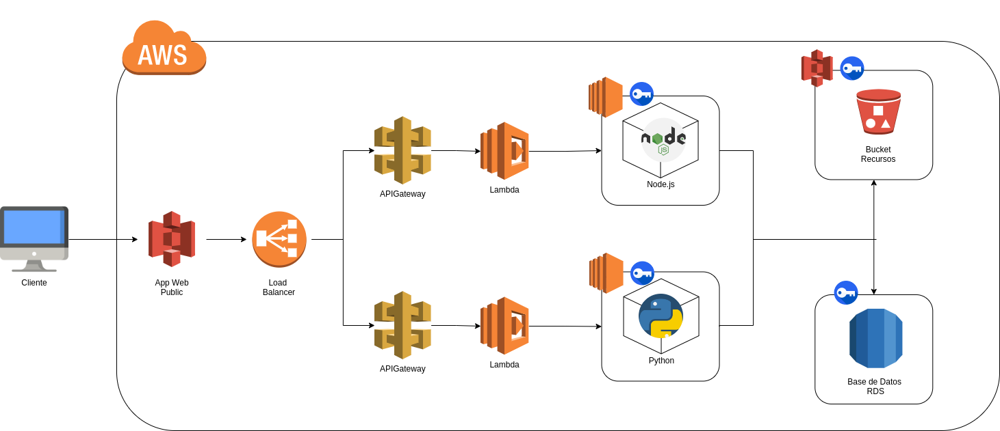

# **MANUAL DE TECNICO  (eStudent)**

## Integrantes

| Carnet     | Nombre                                     |
|------------|--------------------------------------------|
| 201902363  | Christopher Iván Monterroso Alegria        |
| 201902219  | Max Rodrigo Durán Canteo                   |
| 200819244  | Edwin Estuardo Ruíz                        |
| 201906562  | Henry Mariano Ambrocio Terraza Perez       |

## **INDICE**

- [**OBJETIVOS DEL PROYECTO**](#objetivos-del-proyecto)
- [**DESCRIPCION DEL PROYECTO**](#descripcion-del-proyecto)
- [**ARQUITECTURA IMPLEMENTADA DEL PROYECTO**](#arquitectura-implementada-del-proyecto)
- [**PRESUPUESTO DEL PROYECTO**](#presupuesto-del-proyecto)
- [**INVESTIGACION DE LOS SERVICIOS UTILIZADOS**](#investigacion-de-los-servicios-utilizados)
- [**BIBLIOGRAFIA**](#bibliografia)

### OBJETIVOS DEL PROYECTO

- **Optimizar la organización académica de los estudiantes** mediante una plataforma que gestione horarios, tareas, actividades y recordatorios de manera eficiente.

- **Proveer herramientas tecnológicas avanzadas** como conversión de documentos, traducción automática y asistencia por voz para mejorar la experiencia de aprendizaje.

- **Garantizar la seguridad y escalabilidad del sistema** mediante la autenticación de usuarios con Amazon Cognito y una arquitectura sin servidor utilizando servicios como Lambda y API Gateway.

### DESCRIPCION DEL PROYECTO

eStudent es un sistema de gestión estudiantil que ofrece una serie de funcionalidades para mejorar la productividad y organización de los estudiantes. La plataforma permite a los usuarios gestionar su horario de estudios, registrar y organizar tareas y actividades, y recibir recordatorios sobre fechas clave. Además, eStudent incorpora herramientas avanzadas que potencian el aprendizaje, como:

- **Conversor de documentos:** Permite convertir archivos a diferentes formatos y traducir textos automáticamente a múltiples idiomas.

- **Manejo de tareas y actividades:** Proporciona un espacio para la creación y gestión de listas de tareas, con notificaciones automáticas.

- **Recordatorios:** El sistema ofrece recordatorios automáticos para ayudar a los estudiantes a organizarse mejor.

- **Herramientas innovadoras:** eStudent integra reconocimiento de imágenes (Rekognition), conversión de texto a voz (Polly) y traducción automática (Translate) para ofrecer soluciones prácticas y accesibles.

### ARQUITECTURA IMPLEMENTADA DEL PROYECTO

* **S3 (Simple Storage Service):**
  * **Bucket 1:** Alojamiento del sitio web estático.
  * **Bucket 2:** Almacenamiento de archivos multimedia.
* **EC2 (Elastic Compute Cloud):**
  * **Instancias:** Dos instancias configuradas para ejecutar servidores que manejan las solicitudes de la aplicación.
  * **Lenguaje:** Servidores implementados en Node.js y Python.
* **Load Balancer:**
  * **Balanceador de carga:** Distribuye el tráfico entre las dos instancias de EC2, asegurando alta disponibilidad y manejo eficiente de las solicitudes.
* **RDS (Relational Database Service):**
  * **Base de datos:** Almacena la información de usuarios, albumnes e imagenes.
* **Rekognition:**
  * **Translate:** 
  * **Comprehend:**
* **IAM (Identity and Access Management):**
  * **Usuarios y roles:** Gestión de permisos y acceso a los diferentes servicios de AWS.

### PRESUPUESTO DEL PROYECTO

El presupuesto del proyecto depende del uso de los servicios de AWS, tener en consideracion que puede llegar cambiar el total estimado si se llega a pasar lo mencionado

| Servicio                    | Uso Mensual Estimado       | Costo Estimado          |
| --------------------------- | -------------------------- | ----------------------- |
| Amazon Cognito              | 10,000 usuarios activos    | $25                     |
| API Gateway                 | 1 millón de solicitudes    | $3.50                   |
| AWS Lambda                  | 2 millones de invocaciones | $15                     |
| Amazon EC2                  | 2 instancias t2.micro      | $18.56 ( por instancia) |
| Elastic Load Balancer (ELB) | 500 horas de uso           | $16                     |
| Amazon S3                   | 100 GB de almacenamiento   | $2.30                   |
| Amazon RDS (MySQL)          | 1 instancia db.t2.micro    | $15.20                  |
| Amazon Rekognition          | 5000 imágenes procesadas   | $5                      |
| Amazon Translate            | 100,000 caracteres         | $15                     |
| Amazon Polly                | 100,000 caracteres         | $4                      |
| Total Estimado              |                            | $119.56/mes             |

### INVESTIGACION DE LOS SERVICIOS UTILIZADOS
- **Amazon Cognito:** Servicio de autenticación que facilita la gestión de usuarios, permitiendo crear cuentas, iniciar sesión de forma segura y gestionar la autenticación multifactor.

- **API Gateway:** Servicio que permite la creación, publicación y monitoreo de APIs seguras y escalables. Actúa como un intermediario entre los clientes y las funciones de AWS Lambda.

- **AWS Lambda:** Servicio de computación sin servidor que ejecuta código en respuesta a eventos, permitiendo una escalabilidad automática y un pago solo por uso.
- **Amazon EC2:** Proporciona capacidad de procesamiento en la nube, permitiendo ejecutar aplicaciones escalables y seguras.

- **Elastic Load Balancer (ELB):** Distribuye el tráfico entrante entre las instancias de EC2, asegurando alta disponibilidad y distribución de carga.

- **Amazon S3:** Servicio de almacenamiento de objetos que permite almacenar y recuperar cualquier cantidad de datos en la nube, con alta disponibilidad y durabilidad.

- **Amazon RDS:** Servicio de base de datos relacional que facilita la configuración, operación y escalado de bases de datos en la nube, garantizando rendimiento y seguridad.

- **Amazon Rekognition:** Proporciona análisis de imágenes y videos mediante el uso de aprendizaje automático, permitiendo funciones como el reconocimiento facial o de objetos.

- **Amazon Translate:** Servicio de traducción automática que soporta múltiples idiomas, facilitando la conversión rápida de contenido.

- **Amazon Polly:** Convierte texto a voz, ofreciendo una experiencia interactiva y accesible para los estudiantes con capacidades auditivas.

### BIBLIOGRAFIA
- Amazon Cognito: https://aws.amazon.com/es/cognito/
- API Gateway: https://aws.amazon.com/es/api-gateway/
- AWS Lambda: https://aws.amazon.com/es/lambda/
- Amazon EC2: https://aws.amazon.com/es/ec2/
- Elastic Load Balancer (ELB): https://aws.amazon.com/es/elasticloadbalancing/
- Amazon S3: https://aws.amazon.com/es/s3/
- Amazon RDS: https://aws.amazon.com/es/rds/
- Amazon Rekognition: https://aws.amazon.com/es/rekognition/
- Amazon Translate: https://aws.amazon.com/es/translate/
- Amazon Polly: https://aws.amazon.com/es/polly/